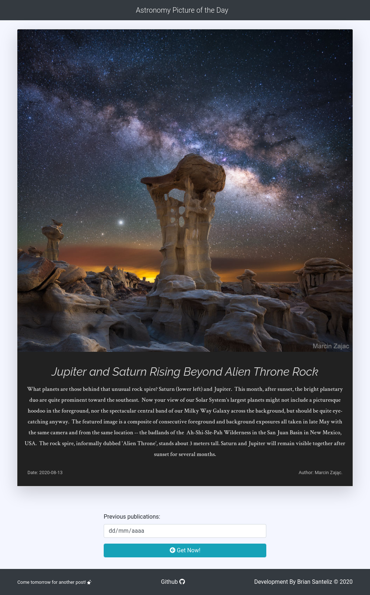
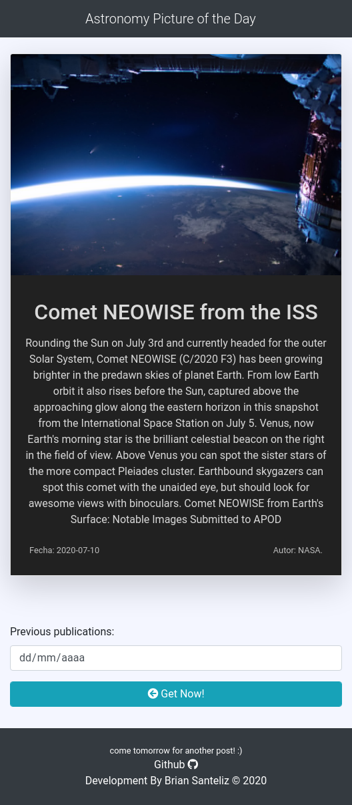

# nasa-api-vanillaJS

APOD is a web app to get one astronomical image per day and navigate to previous posts using NASA API.
This app is build  using Vanilla JS.

Resources:
* Bootstrap 4
* API Nasa: https://api.nasa.gov/
* Animate Css
* Fontawesome

App: https://brian-santeliz.github.io/nasa-api-vanillaJS/

---

---
Responsive:
